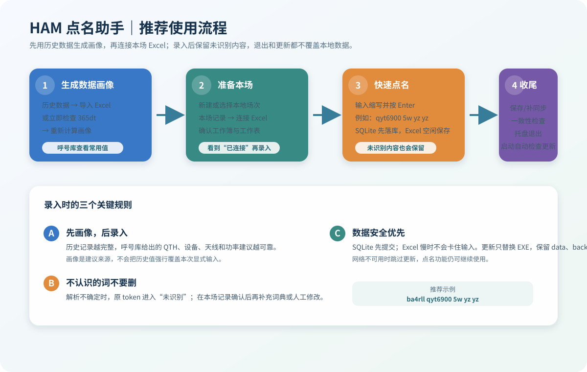

# 江苏省中继 HAM 智能点名录入助手

Windows 本地点名辅助程序：通过**缩写 + 规则解析 + SQLite 历史 + 模糊匹配**大幅减少主控
录入操作，支持 Excel 实时写入、365dt 历史同步。

**纯本地，无任何 AI / LLM / Token / 语音识别依赖，断网可用。**

## 功能

- 快速输入：`bg4tki njqx k6 y 5` → `BG4TKI | 南京栖霞 | 泉盛 UV-K6 | 原 | 5W`
- 字段自由顺序：呼号 / QTH / 设备 / 天线 / 功率 乱序均可
- 重复现场缩写可按字段消费：`... yz yz` → 第一个识别为扬州，第二个识别为原装天线；`qyt6900` 可直接识别
- 未识别 token 不丢弃：会写入 SQLite 的 `unmatched` 字段，并在 Excel 没有该列时自动补建“未识别”列
- 拼音缩写：`njqx`→南京栖霞，`ahwh`→安徽芜湖；重名（如 `gl`）给出候选必须选择
- 历史建议：输入呼号自动给出「最近一次 / 最常用」建议，**`Tab` 接受，绝不自动提交**
  （Enter 只提交本次显式输入；历史建议必须显式接受后才进入提交）
- 模糊匹配：错拼/多一字少一字给出候选；只有 `top1 >= high` 且与 `top2` 分差足够才自动接受
- SQLite 主数据库：每次提交先 COMMIT 再写 Excel；Excel 失败不影响数据
- **Excel 绑定是场次级的**：每个场次记录自己的工作簿/工作表；切换场次断开旧绑定；
  指定工作簿缺失时 fail-closed，绝不回退到任意打开的工作簿
- Excel 下一行基于「最后一条有效数据记录」，内部空行不会覆盖已有数据
- Excel 同步状态机：`pending → written → persisted → verified`；
  Save 失败保持 `error`/`pending`，绝不假标记已同步
- Excel 表头自动识别（不写死列）+ schema 校验（缺序号/时间/呼号/QTH 拒绝连接）
- 「重新同步本场」「导出本场」重建；`rewrite_all` 只清理受管列，保留用户列/公式列/备注列
- 历史 Excel 批量导入（`.xlsx` only，单文件/文件夹）+ 原子导入 + 跨文件去重
- 365dt 历史同步：**真增量**（按每呼号 count 变化 / 未同步 / 上次失败决定拉取），
  默认单次上限 200，部分失败可重试，UID 切换自动隔离
- 一键撤销（软删除）、修改审计、数据库每日备份（quick_check + 原子改名）、
  崩溃恢复（恢复顺序：读已有 active → 恢复 → 仍无才建新场次）
- 悬浮快速录入窗：置顶 / 可拖动 / 可调透明度 / 全局快捷键呼出
- Windows 单实例保护：重复启动拒绝，避免第二个 SQLite writer / Excel controller / 365dt sync

## 推荐使用流程



### 1. 第一次使用：先生成数据画像

数据画像来自本地已经导入的历史签到记录，用来给呼号提供最近一次和最常用的 QTH、设备、天线、功率建议。它不是 AI 推测，也不会覆盖本次明确输入的内容。

1. 启动软件，打开“历史数据”选项卡。
2. 点击“导入 Excel 文件”选择历史 `.xlsx`，或点击“导入文件夹”批量导入历史文件。也可以在“设置 → 365dt / 监听”检查 UID 后点击“立即检查 365dt”。
3. 等待导入日志显示完成，然后点击“重新计算画像”。
4. 打开“呼号库”，搜索一个已有呼号，确认“最常用 QTH / 设备 / 天线 / 功率”和最近历史已经出现。
5. 如果历史数据里有稳定的现场缩写，可点击“生成词典建议”，人工检查后点击“加入选中”；程序不会未经确认把推测直接写入词典。

没有历史数据时也可以直接点名，只是首次建议较少；后续每次提交都会积累本地画像。

### 2. 准备本场和 Excel

1. 在顶部点击“新建场次”，或点击“选择场次”回到本地已有场次。场次选择只读取本地数据库，不会把已结束的远程场次混进来。
2. 如果还没有模板，打开“设置 → Excel → 生成空白模板”，保存为 `.xlsx`。
3. 打开“本场记录”，点击“连接 Excel”，选择本场工作簿和工作表。
4. 看到“已连接”后再开始录入。每个场次独立保存自己的工作簿、工作表和同步状态，切换场次不会误写上一场。

### 3. 快速点名

在“快速点名”或悬浮窗输入一行缩写，按 Enter 提交。例如：

```text
ba4rll qyt6900 5w yz yz
```

会得到：

| 输入内容 | 识别结果 |
| --- | --- |
| `ba4rll` | 呼号 `BA4RLL` |
| 第一个 `yz` | QTH `扬州` |
| `qyt6900` | 设备 `全易通 QYT-6900` |
| 第二个 `yz` | 天线 `原` |
| `5w` | 功率 `5W` |

字段可以乱序输入，常用输入还可以写成 `bg4tki njqx k6 y 5`。`Enter` 会先清空输入框并进入下一位录入；`Tab` 只接受历史建议，不会代替 Enter 自动提交。

如果程序暂时无法确认某个 token，原始内容会进入“未识别”字段，并同步到 Excel 的“未识别”列；不要因为没有识别就把现场信息删掉。确认后可以在“本场记录”双击修改，或在“设置 → 词典”补充稳定别名。

### 4. 修改、保存和结束

- 在“本场记录”双击一行，选择 QTH、设备、天线、功率或信号后修改。SQLite 会先保存，Excel 单行写入和 Save 在后台执行，Excel 较慢时主窗口仍可继续输入。
- 连续点名时 Excel 默认采用空闲合并保存；可以按 `Ctrl+S` 立即保存，或点击“保存/补同步”重试失败记录。
- 点名结束前点击“一致性检查”确认 SQLite 与 Excel 的序号、呼号和字段；确认后点击“结束本场”。
- 通过托盘菜单“退出”正常退出，下次启动会优先恢复上次本地进行中的场次；异常中断时会显示恢复选项。

## 自动更新与 Release

最新版发布在 [GitHub Releases](https://github.com/HX-Wrdzgzs/ham-checkin-assistant/releases/latest)。下载 Release 中的单文件 `HAM点名助手.exe`，不需要 `_internal` 文件夹。

- 发布版 EXE 启动约 1.5 秒后在后台检查最新稳定 Release，网络请求不会阻塞快速录入窗口。
- 发现新版本后会先询问；确认后下载 `HAM点名助手.exe`，并用 Release 中的 `SHA256SUMS.txt` 校验，校验失败不会修改当前软件。
- 如果下载内容遇到 CDN 瞬态异常导致校验不一致，会清理临时文件并绕过缓存重试，最多尝试 3 次；连续失败才提示错误。
- 下载完成后，更新程序等待当前 EXE 正常退出，再替换并重新启动；`data/`、`logs/`、`backup/` 和 `config.json` 位于 EXE 同级，不会被更新包覆盖。
- GitHub API 暂时限流时会读取仓库的公开更新清单；两条路径都不可用时只跳过本次检查，本地点名、Excel 和 SQLite 不受影响。也可以从托盘菜单点击“检查更新”。
- 用 `python app.py` 源码运行时不自动替换 Python 源码；托盘中的“检查更新”仍可打开 Release 页面。

如果 Windows SmartScreen 第一次提示未知发布者，请先确认文件来自上面的 Release 页面，并核对发布页的 SHA256 校验文件；不要从其他链接下载同名 EXE。

## 运行

```bash
pip install -r requirements.txt
python app.py
```

首次运行会在项目目录生成 `data/`（SQLite）、`logs/`、`backup/` 与 `config.json`。

## 快捷键

| 按键 | 功能 |
| ---- | ---- |
| Ctrl+Space | 唤出/隐藏悬浮窗 |
| Enter | 确认录入（仅提交本次显式输入 / 已接受的历史） |
| Tab | 接受历史建议 |
| Esc | 清空当前输入 |
| Ctrl+Z | 撤销输入框文字 |
| Ctrl+Shift+Z | 撤销上一条记录（软删除，Excel 不在界面线程整场重排） |
| Ctrl+S | 立即保存当前场次待保存的 Excel 记录 |

快速点名时，按 Enter 会先清空输入框并立即进入下一位录入；SQLite 先落库，
Excel 记录先写入当前工作簿内存，在停止输入达到“空闲保存延迟”后合并 Save。
默认延迟为 600 ms，可在“设置 → Excel”调整。若 Excel 保存失败，记录会保留为
未同步状态，可用“保存/补同步”继续处理。

在“本场记录”中修改 QTH/设备/天线/功率/信号时，SQLite 会立即更新；Excel 单行写入
和 Save 由后台 COM worker 执行，Excel 重算或保存较慢时不会冻结主窗口。后台失败时
记录保留为未同步/冲突状态，可用“保存/补同步”重试。

## Excel 行为说明

- 场次选择只显示本地场次；通过托盘“退出”正常关闭后，下次启动自动回到上次本地进行中场次，异常中断仍保留恢复提示。
- 每个场次通过「连接 Excel」按钮绑定一个工作簿+工作表，绑定写入该场次。
- 新场次默认无绑定（显示未连接）；切回旧场次自动恢复其绑定。
- Excel 旧模板没有“未识别”列表头时，程序只在首个空列表头补建，不覆盖已有备注或其它人工列。
- 写入行 = 该表「最后一条有效记录」之后（按 序号/呼号 主列判定）。
- 更新记录前先校验 `行.序号 == 记录序号 且 行.呼号 == 记录呼号`；不匹配搜索唯一匹配，
  否则标记 conflict 拒绝写入。
- 外部字符串以 `= + - @` 开头时按文本写入，防公式注入。
- 快速录入的 `written` 行在空闲批量保存时先做序号+呼号身份校验，原行有效时只 Save，
  不重复追加；只有待写入或行漂移记录才追加。

## 365dt 说明

- 默认 `dt365_max_fetch = 200`（可在设置调整）；显示「已同步 x/y」。
- 增量判断基于 per-callsign 状态：排行 count 变化 / 从未同步 / 上次失败 → 才拉详情。
- 记录身份含 `source_uid`；切换 UID 进入全新同步命名空间。
- 数据库 `UNIQUE(source, source_record_id)` 负责最终去重。

## 备份 / 恢复

- 每天首次启动自动备份到 `backup/`（temp → SQLite backup → `PRAGMA quick_check` → 原子改名），
  并生成 `metadata.json`（版本 / schema / checksum）。
- 恢复：`restore_backup(备份文件, 目标库)` 先验证备份、写临时副本校验后原子替换目标。
- 损坏备份会拒绝恢复。

## 测试

```bash
python -m unittest discover -s tests -v
```

测试全部使用隔离的临时配置/数据库/Mock Excel，绝不触碰真实 `config.json`、`data/`、`backup/`。

## 打包 EXE

```bash
pip install pyinstaller pillow
python build.py
```

`build.py` 生成单文件 `HAM点名助手.exe` 并部署到 Downloads，不需要携带 `_internal` 文件夹。
运行时产生的 `data/ logs/ backup/ config.json` 会放在 EXE 同级目录；重新打包或更新时会先备份/恢复，
绝不覆盖已有 DB/backup/config。若检测到旧文件夹版含运行数据，会保留旧目录作为恢复来源。

## 目录

```
app.py                入口（含单实例 + 全局异常处理）
config/               设置（原子写）
core/                 Parser / 预测 / 模糊 / 时间规范化
database/             连接 / 迁移 / 仓库 / 默认词典
normalizers/          呼号/QTH/设备/天线/功率 + 行政区划库
providers/            365dt / Excel 导入 / NRL Nanny 只读源
services/             应用服务（UI 唯一入口）/ 同步服务 / NRL 监听服务
ui/                   PySide6 界面（含 NRL 监听页）
data/ logs/ backup/   运行时数据
tests/                单元 + 回归 + Mock COM 测试
version.py            版本号
CHANGELOG.md          变更日志
```

## NRL Nanny 只读监听（第四阶段）

- `providers/nrl_nanny.py` + `services/monitor_service.py`：轮询抓取活动源，保留原始内容，
  提取候选呼号，状态机 `offline/connecting/online/degraded/error`，自动断线重连。
- UI「NRL 监听」页：启动/停止/重连、状态显示、最近活动、候选呼号，点击候选填入快速录入框。
- **原则：NRL 只提供候选，绝不自动写数据库、绝不自动提交签到。**
- 网络容错：超时、连接重置、非法响应、空活动、请求中停止、应用退出期间停止均有测试覆盖。

