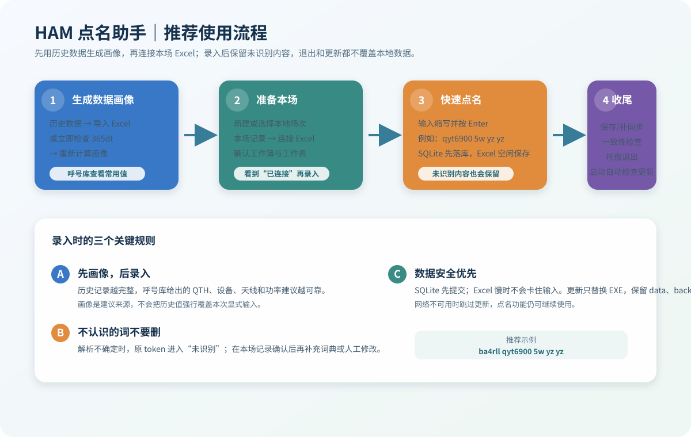

# 江苏省中继 HAM 智能点名录入助手

Windows 本地点名辅助程序：通过**缩写 + 规则解析 + SQLite 历史 + 模糊匹配**大幅减少主控
录入操作，支持 Excel 场后导出/可选同步、365dt 历史同步。

**核心点名功能纯本地，无任何 AI / LLM / 语音识别依赖，断网可用；可选的 QTH 后台联网同步需要用户自行配置数据源。**

当前候选版本：**Native 1.0.16**（C# / .NET 10 / WPF / SQLite）。旧 Python 版 **0.9.4** 仍作为兼容代码保留，Native 版不依赖 Python、Qt 或 Excel COM。

Native 1.0.16 将原生数据写入 `%LOCALAPPDATA%\\HAM点名助手\\data\\ham_checkin_native.db`；旧版 Python 数据库仍是同目录的 `ham_checkin.db`。如果存在旧版 Python 数据库，程序会先在 `backup\\legacy-python-*.db` 生成备份，再只读导入场次和签到；旧数据库不会被删除或覆盖。程序启动即在后台检查 GitHub Release，快速录入仍不等待网络；设置页的“关于 / 检查更新”可手动重试。

## 功能

- 快速输入：`bg4tki njqx k6 y 5` → `BG4TKI | 南京栖霞 | 泉盛 UV-K6 | 原 | 5W`
- 字段自由顺序：呼号 / QTH / 设备 / 天线 / 功率 乱序均可
- 重复现场缩写可按字段消费：`... yz yz` → 第一个识别为扬州，第二个识别为原装天线；`qyt6900` 可直接识别
- 未识别 token 不丢弃：先写入 SQLite 的 `unmatched` 字段；Native 新导出固定九列，不把未识别原文塞进 Excel
- 拼音缩写：`njqx`→南京栖霞，`ahwh`→安徽芜湖；重名（如 `gl`）给出候选必须选择
- QTH 地点库：行政区缩写离线展开；道路、学校、车站和地标可导入或在后台同步；唯一精确命中才自动补齐省/市/区，同名地点保留候选
- 快速录入：只解析当前输入原文；不会用历史数据覆盖当前输入，Enter 只提交本次显式输入
- 模糊匹配：错拼/多一字少一字给出候选；只有 `top1 >= high` 且与 `top2` 分差足够才自动接受
- SQLite 主数据库：快速点名先 COMMIT SQLite，不连接/读取/写入 Excel；场后导出或显式同步不影响点名数据
- **Excel 绑定是场次级的**：每个场次记录自己的工作簿/工作表；切换场次断开旧绑定；
  指定工作簿缺失时 fail-closed，绝不回退到任意打开的工作簿
- Excel 下一行基于「最后一条有效数据记录」，内部空行不会覆盖已有数据
- Excel 同步状态机：`pending → written → persisted → verified`；
  Save 失败保持 `error`/`pending`，绝不假标记已同步
- Excel 表头自动识别（不写死列）+ schema 校验（缺序号/时间/呼号/QTH 拒绝连接）
- 「重新同步本场」「导出本场」重建；`rewrite_all` 只清理受管列，保留用户列/公式列/备注列
- 历史 Excel 批量导入（`.xlsx` only，单文件/文件夹）+ 原子导入 + 跨文件去重
- 365dt 历史同步：**真增量**（按每呼号 count 变化 / 未同步 / 上次失败决定拉取），
  默认单次上限 200，部分失败可重试，UID 切换自动隔离
- 一键撤销（软删除）、修改审计、数据库每日备份（quick_check + 原子改名）、
  正常启动默认本地第 1 场；异常中断仍显示恢复选项，用户可随时手动选择其它本地场次
- 悬浮快速录入窗：置顶 / 可拖动 / 可调透明度 / 全局快捷键呼出
- Windows 单实例保护：重复启动拒绝，避免第二个 SQLite writer / Excel controller / 365dt sync

## 推荐使用流程



### 1. Native 1.0.16 第一次使用

Native 版启动后直接进入“快速点名”，不要求先生成画像、不打开历史画像页，也不自动连接 Excel。全国行政区和已验证的本地设备别名先可用，其余资料在后台加载。

1. 启动后先确认顶部场次、日期、主控呼号和中继名称。
2. 在“快速点名”或“快速小窗”输入现场原文并按 Enter。
3. 需要补充工信部型号或地点包时，在“资料库”中手动下载或更新；后台任务不会阻塞录入。
4. 历史记录只作为可选建议，不会自动覆盖本次输入。

### 2. 准备本场（Excel 可选）

1. 在顶部点击“新建场次”，或点击“选择场次”回到本地已有场次。场次选择只读取本地数据库，不会把已结束的远程场次混进来。
2. 快速点名不要求先连接 Excel；没有 Excel、Excel 正在打开或 Excel 卡顿时，仍可以正常录入，记录先保存在 SQLite。
3. 点名结束后，可以在“本场记录”点击“导出本场”生成新的 `.xlsx`；如果需要回写既有工作簿，再按需点击“连接 Excel”和“保存/补同步”。
4. 每个场次独立保存自己的工作簿、工作表和同步状态，切换场次不会误写上一场。

### 3. 快速点名

在“快速点名”或悬浮窗输入一行缩写，默认按 Enter 提交。例如：

```text
ba4rll qyt6900 5w yz yz
```

会得到：

| 输入内容 | 识别结果 |
| --- | --- |
| `ba4rll` | 呼号 `BA4RLL` |
| 第一个 `yz` | QTH `扬州` |
| `qyt6900` | 设备 `全易通 QYT-6900` |
| 第二个 `yz` | 天线 `原` |
| `5w` | 功率 `5W` |

字段可以乱序输入，常用输入还可以写成 `bg4tki njqx k6 y 5`。默认 `Enter` 会先清空输入框并进入下一位录入；`Tab` 只接受历史建议，不会代替提交键自动提交。可以在“设置 → 常规 → 快速点名写入键”改为 Space、Ctrl+Enter、Shift+Enter、Alt+Enter 或 F2～F12。

Space 模式专门照顾只录呼号的高频点名：输入一个有效呼号后按空格即可写入并进入下一位，普通 Enter 不会推进。因为完整记录本身需要空格分隔字段，Space 模式下如需继续填写 QTH/设备等，请用 `Shift+Space` 输入第一个分隔空格，最后用 `Ctrl+Enter` 提交完整记录。

如果程序暂时无法确认某个 token，原始内容会进入 SQLite 的“未识别”字段和字段编辑器；Native 新导出的 Excel 永远不创建“未识别”列。不要因为没有识别就把现场信息删掉，确认后在“本场记录”双击对应字段修改。

### 3.1 设备缩写的两条来源

> 兼容说明：本节中“历史数据 → 生成词典建议”等入口属于旧 Python 版。Native 1.0.16 目前通过“资料库”的本地型号搜索、内置现场别名和字段编辑器完成同一类操作，不在输入热路径访问网络。

设备是否被工信部型号核准，不决定它能不能参加点名。程序把设备缩写分成两类：

1. **工信部型号缩写**：下载本地电台型号库后，程序从官方型号本身生成可解释缩写。例如 `UV-K5` 可输入 `uvk5` 或 `k5`，`QYT-6900` 可输入 `qyt6900`。这类缩写只作为本地资料库的动态候选，不会把“申请单位”或相似数字硬塞进型号，也不会因为没有核准记录就否定现场设备。
2. **本地/历史设备缩写**：未核准、旧型号、进口二手机型和现场俗称不依赖工信部。只要已有记录明确保存过“原始设备 → 标准设备”，程序会提取其中的字母+数字型号作为**历史缩写**；一个缩写如果对应多个标准设备，则不自动选择，避免误填。

根据 2026-08-28 提供的点名表，常用的 `m8268`、`m8668`、`p8260`、`r7`、`gm338`、`gp338`、`gm3688`、`uvk1`、`uvk5`、`uvk6`、`uvk18`（`UV-K1(8)`）、`tm800`、`tm8118`、`tm481`、`shk8800`、`1907r`、`5dr` 等已作为现场设备别名内置；输入裸型号即可补全为名单中的规范设备。它们是用户确认的现场词典，不代表一定存在工信部型号核准记录。

其他未内置、未核准或旧型号仍可采用历史学习：第一次明确输入 `bg4aaa 摩托罗拉 X6200` 并提交后，下一次输入 `x6200` 可以得到 `摩托罗拉 X6200（历史缩写 x6200）`。如果一个缩写对应多个品牌或标准值，程序不会凭空判断，应在“本场记录”把设备改成完整标准名，或在“历史数据 → 生成词典建议”中人工检查后加入。

手工确认某个非工信部机型的方法：打开“设置 → 词典 → 设备别名”，标准值填写例如 `摩托罗拉 M8268`，别名填写 `m8268`；也可以先填写标准值后点击“生成缩写”，再点击“添加”。“生成词典建议”现在会检查本地签到、365dt 和 Excel 导入记录，勾选“加入选中”后才永久写入词典。

### 3.2 可选：下载工信部电台型号库

工信部资料库不是快速点名的必需网络服务。首次使用时，在“设置 → 365dt / 监听 → 工信部电台库”点击“首次下载电台型号库”，程序会在后台按顺序扫描工信部结果查询中的“无线电发射设备型号核准”（`category 352`）全部分页。同步期间仍可以继续点名、写入 SQLite 和保存 Excel。

同步只把适合通联的手持台、车载台、对讲机、基地台、固定台、中继/转发台、短波/单边带电台及业余无线电设备写入本地库；蓝牙、WLAN、无线模块、手机、路由器、定位/数据终端等会被排除，无法确定的名称只进入未分类统计。程序不会使用“进关核准”作为设备标准库，也不会因为现场输入一个型号就临时访问官网。

使用步骤：

1. 首次下载前确认“型号库每页数量”（默认 1000）；官网拒绝大分页时会自动降低到可用大小。
2. 点击“首次下载电台型号库”并等待状态显示完成。网络中断或点击“取消同步”后，已完成页面会留下断点；下次点击“首次下载”可继续，点击“重新完整同步”则清理半成品并重新扫描。
3. 完整校验成功后，旧快照才会被原子替换。同步失败、取消或校验失败不会把半成品提供给点名和资料补全。
4. 下载完成后，“打开型号库搜索”和现场资料补全只查询本地快照，支持 `UV-K6` / `uvk6` / `uv k6` 等规范化输入；同型号续证记录会合并展示，过期记录仍可搜索但会标注状态。
5. 如勾选“每周空闲时检查电台型号库更新”，程序只在没有其他后台任务且已有正式库时做头部增量检查；它不会在首次启动时偷偷下载全库，也不会弹窗打断点名。完整重新扫描仍由用户手动触发。
6. 官网默认分页虽然是 5 条，但接口允许返回 500～1000 条大页且偏移仍按 5 条计算；程序会复用同一网页会话。若某个大页的总数或记录边界异常，会自动用官方 5 条分页拼回该页，跨页重复只去重，同页重复或最终唯一数量不足则安全停止。

型号库与点名数据库分离，正式运行文件位于 `%LOCALAPPDATA%\HAM点名助手\data\miit_radio_catalog.db`。它不依赖 EXE、快捷方式或当前工作目录；即使资料库损坏，也可以重新下载，不会影响点名记录和每日点名数据备份。

### 3.3 精确道路、学校和地标 QTH

内置行政区库负责 `njxw`、`njgl` 这类缩写；提交时会展开为完整层级，例如 `njxw` → `江苏省南京市玄武区`，`njgl中山路169号` → `江苏省南京市鼓楼区中山路169号`。道路名本身通常跨城市重名，程序不能只凭“中山路”猜城市。

需要让只有道路/学校/车站名称也能自动补齐时，在“设置 → QTH 地点”导入本地地点包。每条记录至少包含 `name`、`province`、`city`、`district`、`canonical_qth`，可选 `aliases`、`kind`；JSONL/CSV 导入在后台执行，地点检索始终只读本地，不会在输入时联网。唯一精确映射会自动采用，同名映射只显示候选供人工选择；用户确认提交过的道路/门牌/地标也会作为本地学习样本供以后离线使用。

地点库支持后台自动同步：启动后会用程序内置行政区快照校准 `njxw`、`njgl` 等缩写；达到“自动同步间隔”（默认 24 小时）后，在空闲时继续检查可选的 HTTPS 地点包。若填写自己的天地图 Key，软件每次最多缓存设置数量的、已经出现在本地历史记录中的道路/学校/车站 QTH，不做全国 POI 批量下载。输入热路径不依赖网络；远程请求失败时保留上次地点库，不影响 SQLite 点名记录。

### 4. 修改、保存和结束

- 在“本场记录”双击一行，选择 QTH、设备、天线、功率或信号后修改。SQLite 会先保存；只有存在对应 Excel 绑定时，单行写入和 Save 才由后台执行，Excel 较慢时主窗口仍可继续输入。
- 快速点名不连接 Excel，也不等待 Excel 空闲保存；可以在场后“导出本场”，或连接对应工作簿后点击“保存/补同步”重试未同步记录。
- 点名结束前点击“一致性检查”确认 SQLite 与 Excel 的序号、呼号和字段；确认后点击“结束本场”。
- 通过托盘菜单“退出”正常退出，下次启动默认选择本地“第 1 场点名”；如需继续其它场次，点击顶部“选择场次”。异常中断时仍会先显示恢复选项。

## 自动更新与 Release

最新版发布在 [GitHub Releases](https://github.com/HX-Wrdzgzs/ham-checkin-assistant/releases/latest)。Release 的主附件是单文件 `HAM.exe`，同时发布完全相同的旧版兼容附件；GitHub 的物理下载名为 `HAM-legacy.exe`、显示 label 为 `HAM点名助手.exe`（GitHub 会将非 ASCII 上传文件名归一化），不需要 `_internal` 文件夹；自动更新安装后仍会替换用户当前正在使用的程序文件，不要求用户改变快捷方式。

- 发布版 EXE 在每次真实初始化时立即后台检查最新稳定 Release，网络请求不会阻塞快速录入窗口。
- 发现新版本后会先询问；确认后下载 `HAM.exe`（同时兼容旧 Release 的中文 label/`HAM点名助手.exe`），并用 Release 中同时列出两个文件名的 `SHA256SUMS.txt` 校验，校验失败不会修改当前软件。
- 如果下载内容遇到 CDN 瞬态异常导致校验不一致，会清理临时文件并绕过缓存重试，最多尝试 3 次；连续失败才提示错误。
- 下载完成后，更新程序等待当前 EXE 正常退出，再替换并重新启动；运行数据位于 `%LOCALAPPDATA%\HAM点名助手\`，不依赖 EXE 所在目录，也不会被更新包覆盖。
- GitHub API 暂时限流时会读取 `main/updates/latest.json` 稳定更新清单；0.9.2/0.9.3 使用过的 `codex/ham-checkin-release` 清单会在正式 Release 时同步刷新，帮助旧客户端完成一次跨版本升级。两条路径都不可用时只跳过本次检查，本地点名、Excel 和 SQLite 不受影响。也可以从托盘菜单点击“检查更新”。
- 发布流程由 `.github/workflows/release.yml` 自动执行：推送与 `version.py` 一致的 `vX.Y.Z` Tag 后，会先跑完整测试，再构建单文件 EXE、生成主/兼容完全相同的附件（兼容附件使用 ASCII 物理名 + 中文 label）、生成双条目真实 SHA256、创建/刷新 GitHub Release，并自动把最新清单写回 `main/updates/latest.json`。无需手工填写 SHA256。
- 手动测试发布可以使用 `HX-HAM-X.Y.Z` 标签，例如 `HX-HAM-0.0.2`；测试 Release 应标记为 Pre-release，不会写入稳定 `latest.json`，也不会让正式版用户误装测试包。
- 测试版 EXE 会内置完整的 `HX-HAM-X.Y.Z` 版本；测试版启动时按精确 tag 查询对应 Release，关于页面会显示测试版本和该 Release 的更新说明，不会回退显示稳定版版本。
- 用 `python app.py` 源码运行时不自动替换 Python 源码；托盘中的“检查更新”仍可打开 Release 页面。

## 关于、版本与支持

软件顶部的“关于 / 版本”以及托盘菜单中的同名入口会显示：

- 当前运行版本（本地版本）；
- GitHub Release 返回的云端最新版本；
- 当前 Release 的更新说明和发布日期；
- GitHub 项目地址、完整 Release 页面和自愿赞助入口。

版本信息通过公开 GitHub Release 查询，查询失败不会影响本地点名、SQLite 或 Excel；
也可以点击“刷新云端版本”再次查询。发现新版本时，更新对话框会先显示摘要，
可以点击“查看更新说明”打开对应 Release，再决定是否下载更新。

本软件持续免费使用，不设置因版本更新产生的功能收费。赞助完全自愿，不影响软件功能、
自动更新、数据保存或后续使用：

[自愿赞助支持作者](https://www.ifdian.net/a/wrdzgzs?utm_source=copylink&utm_medium=link)

目前没有单独注册的官网，因此 GitHub 项目仓库就是官方发布地址。等以后确定稳定域名后，
再把独立官网补到这里和软件的“关于 / 版本”页面，避免用户遇到多个未经确认的地址。

如果 Windows SmartScreen 第一次提示未知发布者，请先确认文件来自上面的 Release 页面，并核对发布页的 SHA256 校验文件；不要从其他链接下载同名 EXE。

## 运行

```bash
pip install -r requirements.txt
python app.py
```

首次运行会在 `%LOCALAPPDATA%\HAM点名助手\` 生成 `data/`（SQLite）、`logs/`、`backup/` 与 `config.json`，不会在软件目录或快捷方式当前目录生成运行文件。

如果从旧版升级，程序首次启动会把旧 EXE 同目录中的运行数据复制到上述用户目录；复制采用不覆盖策略，旧目录暂时保留，便于确认数据完整后再人工处理。配置中由用户明确填写的绝对路径不会被强行搬动。

## 快捷键

| 按键 | 功能 |
| ---- | ---- |
| Ctrl+Space | 唤出/隐藏悬浮窗 |
| Enter | 默认确认录入；若写入键改成 Space，则普通 Enter 不推进 |
| Space | 可在设置中改为“单呼号写入/下一位”键 |
| Ctrl+Enter | Space 模式下提交包含 QTH/设备等字段的完整记录 |
| Tab | 接受历史建议 |
| Esc | 清空当前输入 |
| Ctrl+Z | 撤销输入框文字 |
| Ctrl+Shift+Z | 撤销上一条记录（软删除，Excel 不在界面线程整场重排） |
| Ctrl+S | 立即保存当前场次待保存的 Excel 记录 |

快速点名时，记录成功写入 SQLite 后才清空输入框；如果保存期间已经输入下一条，下一条草稿不会被清空。默认不触碰 Excel COM。原始输入和“未识别”内容继续保存在 SQLite 和字段编辑器中。
“设置 → Excel”里的传统空闲保存选项只影响已连接 Excel 的兼容同步路径。

在“本场记录”中修改 QTH/设备/天线/功率/信号时，SQLite 会立即更新；Excel 单行写入
和 Save 由后台 COM worker 执行，Excel 重算或保存较慢时不会冻结主窗口。后台失败时
记录保留为未同步/冲突状态，可用“保存/补同步”重试。

## Excel 行为说明

- 场次选择只显示本地场次；正常关闭后下次启动默认选择本地第一场，不再被上次停留的第 N 场带走；异常中断仍保留恢复提示。
- 每个场次通过「连接 Excel」按钮绑定一个工作簿+工作表，绑定写入该场次。
- 新场次默认无绑定（显示未连接）；手动切回旧场次可以恢复其绑定，程序启动时只恢复场次，不自动连接 Excel。
- 旧 Python 兼容同步路径不会擅自删除历史工作簿中的人工列；Native 新导出固定九列，不创建“未识别”列。
- 写入行 = 该表「最后一条有效记录」之后（按 序号/呼号 主列判定）。
- 更新记录前先校验 `行.序号 == 记录序号 且 行.呼号 == 记录呼号`；不匹配搜索唯一匹配，
  否则标记 conflict 拒绝写入。
- 外部字符串以 `= + - @` 开头时按文本写入，防公式注入。
- 快速录入记录初始保持 `pending`，场后导出或显式补同步时再写 Excel；已连接 Excel 的传统路径仍会先做序号+呼号身份校验，避免覆盖和重复追加。

## 365dt 说明

- 默认 `dt365_max_fetch = 200`（可在设置调整）；显示「已同步 x/y」。
- 增量判断基于 per-callsign 状态：排行 count 变化 / 从未同步 / 上次失败 → 才拉详情。
- 记录身份含 `source_uid`；切换 UID 进入全新同步命名空间。
- 数据库 `UNIQUE(source, source_record_id)` 负责最终去重。

## 备份 / 恢复

- 每天首次启动自动备份到 `%LOCALAPPDATA%\HAM点名助手\backup\`（temp → SQLite backup → `PRAGMA quick_check` → 原子改名），
  并生成 `metadata.json`（版本 / schema / checksum）。
- 恢复：`restore_backup(备份文件, 目标库)` 先验证备份、写临时副本校验后原子替换目标。
- 损坏备份会拒绝恢复。

## 测试

```bash
python -m unittest discover -s tests -v
```

测试全部使用隔离的临时配置/数据库/Mock Excel，绝不触碰真实 `config.json`、`data/`、`backup/`。

## 打包 EXE

```bash
pip install pyinstaller pillow
python build.py
```

`build.py` 生成单文件 `HAM点名助手.exe` 并部署到 Downloads，不需要携带 `_internal` 文件夹。
运行时产生的 `data/ logs/ backup/ config.json` 会放在 `%LOCALAPPDATA%\HAM点名助手\`，与 EXE 和快捷方式位置无关；
重新打包或更新不会覆盖用户数据。首次升级会复制旧版 EXE 同目录的运行数据，旧目录会暂时保留作为恢复来源。

## 目录

```
app.py                入口（含单实例 + 全局异常处理）
config/               设置（原子写）
core/                 Parser / 预测 / 模糊 / 时间规范化
database/             连接 / 迁移 / 仓库 / 默认词典
database/miit_catalog.py  独立工信部电台型号库、FTS 和同步断点
normalizers/          呼号/QTH/设备/天线/功率 + 行政区划库
providers/            365dt / Excel 导入 / 工信部查询 / NRL Nanny 只读源
services/             应用服务（UI 唯一入口）/ 工信部同步 / NRL 监听服务
ui/                   PySide6 界面（含 NRL 监听页）
%LOCALAPPDATA%\HAM点名助手\   用户运行时数据（config/data/logs/backup）
tests/                单元 + 回归 + Mock COM 测试
version.py            版本号
CHANGELOG.md          变更日志
```

## NRL Nanny 只读监听（第四阶段）

- `providers/nrl_nanny.py` + `services/monitor_service.py`：轮询抓取活动源，保留原始内容，
  提取候选呼号，状态机 `offline/connecting/online/degraded/error`，自动断线重连。
- UI「NRL 监听」页：启动/停止/重连、状态显示、最近活动、候选呼号，点击候选填入快速录入框。
- **原则：NRL 只提供候选，绝不自动写数据库、绝不自动提交签到。**
- 网络容错：超时、连接重置、非法响应、空活动、请求中停止、应用退出期间停止均有测试覆盖。

